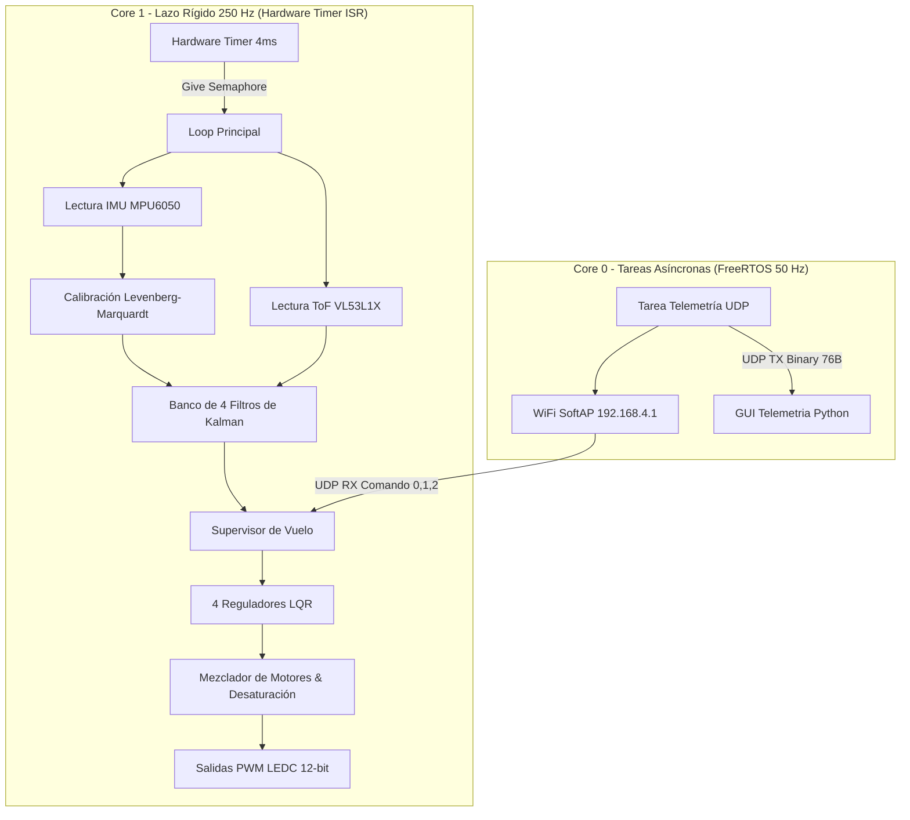
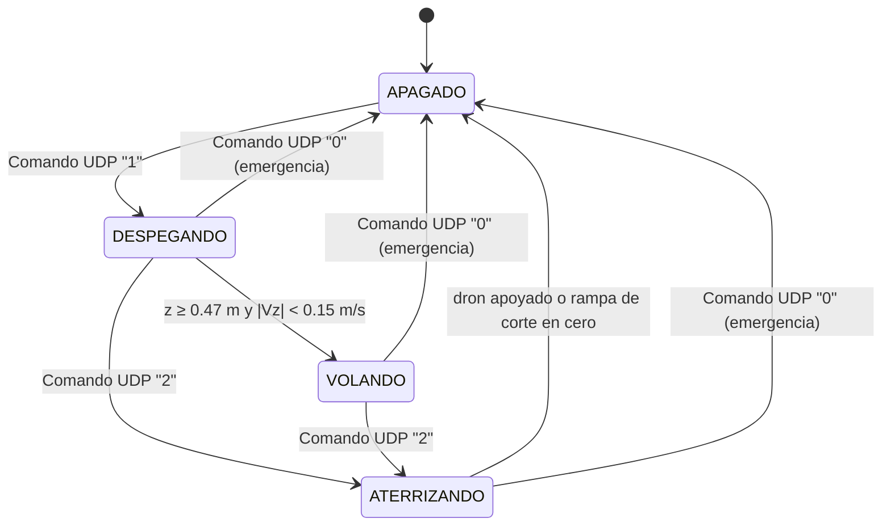

# 🚁 Documentación Técnica del Firmware: Dron LiteWing (LQG / FreeRTOS)

**Autor:** Agustín Schwerdt
**Proyecto:** Proyecto Integrador Profesional (PIP) — Ingeniería Electrónica
**Arquitectura:** Linear Quadratic Gaussian (LQR + Kalman LQE) en tiempo discreto
**Frecuencia del lazo principal:** 250 Hz ($T_s = 4\ \text{ms}$)
**Procesador:** ESP32-S3 (Dual-Core Xtensa LX7 @ 240 MHz)

---

## 📐 1. Visión General

El firmware implementa un esquema **LQG** desacoplado en **cuatro canales independientes** (Roll, Pitch, Yaw y Altitud) que suman **7 estados físicos**.

Se fundamenta en el **Principio de Separación** (Åström & Wittenmark): el problema se divide en dos bloques diseñados de forma independiente.

1. **Filtro de Kalman (LQE):** fusión sensorial estocástica que estima $\hat{x}(k)$ minimizando la covarianza del error. Se resuelve **recursivamente a bordo**, con predicción y corrección completas en cada ciclo de 4 ms.
2. **Regulador Cuadrático Lineal (LQR):** esfuerzo óptimo $u(k) = -L\,(\hat{x}(k) - x_{\text{ref}})$ con matrices $L$ **precalculadas offline** resolviendo la DARE.



> **No hay lazos anidados ni cascadas, no hay control ni estimación de posición horizontal, y no hay acción integral en ningún canal.** Los cuatro reguladores son LQR puro de estado, de un solo nivel.

---

## 📏 2. Convenio de Unidades

Es la regla que mantiene coherentes el cuaderno y el firmware, y conviene tenerla presente antes de tocar cualquier constante:

| magnitud | unidad en todo el firmware |
| :--- | :--- |
| ángulos de actitud ($\phi$, $\theta$) | **grados** |
| velocidades angulares ($p$, $q$, $r$) | **grados/s** |
| altura $z$ y velocidad vertical $v_z$ | **metros**, **m/s** |
| esfuerzo de control $u$ | **cuentas PWM** (0…4095) |

Newton-Euler entrega la aceleración angular en $\text{rad/s}^2$, así que la constante de entrada se convierte a $\text{grados/s}^2$ **antes** de discretizar por ZOH. De esa forma $\Phi$, $\Gamma$, $Q$, $R$ y $L$ viven todos en el mismo sistema de unidades que los estados del filtro:

```
b_actitud = (K_tau / I_xx) * 180/pi = 29.973091 grados/s^2 por cuenta PWM
b_guiñada = (K_kappa / I_zz) * 180/pi = 2.115641 grados/s^2 por cuenta PWM
b_altura  = K_thrust / m              = 0.006129 m/s^2 por cuenta PWM
```

Parámetros del modelo: masa $m = 0.066$ kg en orden de vuelo y empuje de equilibrio `THROTTLE_HOVER = 1600` PWM, con $K_{thrust} = m\,g / 1600$. Si cambia cualquiera de los dos, hay que regenerar $\Gamma$ y $L$ en el cuaderno y copiarlos a `Config.h`.

---

## ⚡ 3. Arquitectura Dual-Core y RTOS

| Núcleo | Tarea | Frecuencia | Sincronización | Responsabilidad |
| :--- | :--- | :--- | :--- | :--- |
| **Core 1** | Lazo de control de vuelo | **250 Hz (4 ms)** | Hardware Timer ISR + semáforo binario | I2C, Kalman, leyes LQR, supervisor y escritura PWM |
| **Core 0** | Telemetría y comandos UDP | **50 Hz (20 ms)** | `xTaskCreatePinnedToCore` | WiFi SoftAP, recepción de comandos, streaming binario de 76 bytes |

### Temporización de 250 Hz

```cpp
controlTimer = timerBegin(1000000);          // 1 MHz -> 1 tick = 1 us
timerAttachInterrupt(controlTimer, &onTimer);
timerAlarm(controlTimer, 4000, true, 0);     // alarma cada 4000 us (250 Hz)

void IRAM_ATTR onTimer() {                   // la ISR solo entrega el semáforo
  BaseType_t xHigherPriorityTaskWoken = pdFALSE;
  xSemaphoreGiveFromISR(timerSemaphore, &xHigherPriorityTaskWoken);
  if (xHigherPriorityTaskWoken) portYIELD_FROM_ISR();
}
```

El `loop()` se bloquea en `xSemaphoreTake(..., portMAX_DELAY)`, así que no consume CPU mientras espera y no acumula el *jitter* de `delay()`.

### Precisión simple obligatoria

La FPU del Xtensa LX7 es de **32 bits**: toda operación en `double` se emula por software. Por eso el lazo usa exclusivamente `sinf`, `cosf`, `atan2f`, `sqrtf`, literales `f` y las constantes `DEG2RAD_F`, `RAD2DEG_F` y `GRAVEDAD_F` de `Config.h`. Las macros `DEG_TO_RAD` / `RAD_TO_DEG` de Arduino son literales `double` y **promueven la expresión entera**, por lo que no deben usarse dentro del lazo.

En `updateKalmanAltura()` los cuatro senos y cosenos se evalúan una sola vez y se reutilizan tanto en la compensación de inclinación del acelerómetro como en la proyección del ToF.

> ⚠️ **No usar punto flotante dentro de una ISR.** `onTimer()` no toca la FPU a propósito.

---

## 🛰️ 4. Adquisición Sensorial y Calibración

### 4.1. IMU MPU6050
* **Bus I2C** a 400 kHz (*Fast Mode*), pines `SDA = 11`, `SCL = 10`. El ToF comparte el mismo bus.
* **DLPF** con `CONFIG = 0x02`: 98 Hz en el giróscopo (retardo 2.8 ms) y 94 Hz en el acelerómetro (retardo 3.0 ms), ambos por debajo del límite de Nyquist (125 Hz).
* **Escalas:** giroscopio $\pm 500\ ^\circ/\text{s}$ (65.5 LSB/(°/s)), acelerómetro $\pm 8g$ (4096 LSB/g).
* **Offset de giróscopo:** promedio de 2000 muestras en el arranque.

### 4.2. Calibración no lineal (Levenberg-Marquardt)

Las aceleraciones crudas se corrigen en tiempo real con el modelo de 9 parámetros ajustado offline en Python:

$$\begin{bmatrix} a_x \\ a_y \\ a_z \end{bmatrix}_{Body} =
\begin{bmatrix} 1 & 0 & 0 \\ \alpha_{yx} & 1 & 0 \\ \alpha_{zx} & \alpha_{zy} & 1 \end{bmatrix}
\begin{bmatrix} S_x & 0 & 0 \\ 0 & S_y & 0 \\ 0 & 0 & S_z \end{bmatrix}
\left( \begin{bmatrix} a_{x,crudo} \\ a_{y,crudo} \\ a_{z,crudo} \end{bmatrix} - \begin{bmatrix} B_x \\ B_y \\ B_z \end{bmatrix} \right)$$

```cpp
constexpr float ALFA_YX = 0.000278f;   constexpr float S_X = 1.005936f;   constexpr float B_X = 0.313151f;
constexpr float ALFA_ZX = 0.001603f;   constexpr float S_Y = 0.997343f;   constexpr float B_Y = 0.016393f;
constexpr float ALFA_ZY = 0.000864f;   constexpr float S_Z = 0.991658f;   constexpr float B_Z = 0.223452f;
```

### 4.3. Sensor láser ToF VL53L1X
* Modo `Short` (hasta 1.3 m, ideal en interiores) con *timing budget* de 33 ms (~30 Hz).
* `leerToF()` solo actualiza `dist_tof_m` cuando `dataReady()` y `range_status == 0`; entre lecturas nuevas conserva el último valor válido.
* El filtro de altura corrige **de forma continua a 250 Hz**, lo que elimina las discontinuidades multitasa y entrega $z$ y $v_z$ suaves, sin el patrón en serrucho de una corrección esporádica.

---

## 🧮 5. Banco de Filtros de Kalman (LQE)

### 5.1. Filtros de actitud (Roll y Pitch, 2×2, $C = I$)

Ambos estados se miden: el ángulo por el acelerómetro y la tasa por el giróscopo.

$$\begin{bmatrix} x_1(k+1) \\ x_2(k+1) \end{bmatrix} = \begin{bmatrix} 1 & h \\ 0 & 1 \end{bmatrix} \begin{bmatrix} x_1(k) \\ x_2(k) \end{bmatrix} + \begin{bmatrix} \gamma_1 \\ \gamma_2 \end{bmatrix} u(k)$$

donde $x_1$ es el ángulo [°] y $x_2$ la velocidad angular [°/s]. La inversión de la matriz de innovación $2\times2$ es analítica ($ad - bc$), sin algoritmos iterativos.

### 5.2. Filtro de guiñada (escalar)

Predicción $\hat r(k{+}1) = \hat r(k) + \Gamma_{yaw}\,u_{yaw}$ y corrección escalar contra el giróscopo Z.

### 5.3. Filtro de altura con *tilt compensation* ($C = [1\ \ 0]$)

La aceleración se proyecta al marco terrestre por matriz de cosenos directores:

$$a_{z,suelo} = -Acc_X \sin\theta + Acc_Y \sin\phi\cos\theta + Acc_Z \cos\phi\cos\theta$$
$$a_{net} = a_{z,suelo} - 9.80665\ \text{m/s}^2$$

$$\hat{z}(k{+}1\vert k) = \hat{z}(k\vert k) + h\,\hat{V}_z(k\vert k) + \tfrac{1}{2}h^2 a_{net}, \qquad \hat{V}_z(k{+}1\vert k) = \hat{V}_z(k\vert k) + h\,a_{net}$$

La distancia del ToF se proyecta a la vertical real con $z_{suelo} = d_{ToF}\cos\phi\cos\theta$ antes de entrar como innovación.

> La entrada de predicción de este filtro **no** es el comando del LQR sino la aceleración medida por la IMU: el modelo de estimación y el de control están separados formalmente (§1.1 del cuaderno).

---

## 🎮 6. Control Óptimo (LQR)

Ganancias resueltas offline por la DARE sobre el modelo en unidades de firmware. **Sin acción integral en ningún canal.**

| canal | ley | pesos | ganancia |
| :--- | :--- | :--- | :--- |
| Roll | $u = -(L_0(\hat\phi - (\phi_{ref} + \text{TRIM}_\phi)) + L_1 \hat p)$ | $Q = \mathrm{diag}(100,\ 250)$, $R = 1$ | `{4.2944, 6.8112}` |
| Pitch | idéntica por simetría ($I_{xx} = I_{yy}$) | igual | `{4.2944, 6.8112}` |
| Yaw | $u = -L(\hat r - r_{ref})$ | $Q = 1200$, $R = 1$ | `{29.9336}` |
| Altura | $u = -(L_0(\hat z - z_{ref}) + L_1 \hat V_z)$ | $Q = \mathrm{diag}(300, 10)$, $R = 10^{-4}$ | `{1714.8206, 810.9143}` |

Las ganancias son la solución de la DARE sobre el modelo físico (brazo $L/\sqrt2$, cuerpo de placa $a \times b$, $K_\kappa = 4 c_\tau k_f$) con las ponderaciones de la tabla. En guiñada, los vuelos mostraron que con $L_{yaw} = 4.47$ el dron giraba a ≈ −44 °/s y con $29.71$ la deriva bajaba a ≈ −9 °/s; de ahí el peso alto de $Q_{yaw}$.

* La salida de altura se satura en $u_{alt} \in [-450, +450]$ PWM (`U_ALT_MAX` en `Config.h`). El límite anterior de $\pm 300$ era insuficiente: cancelar el efecto suelo exige restar ~318 PWM, y con $\pm 300$ el dron no podía completar el descenso.
* En estado `APAGADO`, `calcularControl()` fuerza las cuatro salidas a cero y retorna de inmediato.

### Trims en lugar de integradores

`TRIM_ROLL = -1.5°` y `TRIM_PITCH = 0.0°` desplazan la referencia de actitud para compensar la asimetría de peso residual. Es la alternativa deliberada a aumentar el estado con un integrador, que acumula error con el actuador saturado o con el dron apoyado y provoca *windup* en el despegue.

Los integradores de la planta garantizan error nulo ante cambios de referencia, **pero no ante perturbaciones constantes en la entrada**: con un par constante $d$, el regulador proporcional sólo lo compensa sosteniendo un error $\theta_{ss} = d / L_0$ (en guiñada, $r_{ss} = d / L_{yaw}$). El trim cancela ese error en actitud. En guiñada, la deriva residual se acota con la ganancia.

---

## 🔄 7. Supervisor de Vuelo



El comando `0` se acepta desde **cualquier** estado.

1. **`APAGADO`** — `PWM = 0` en los cuatro motores, `baseThrottleDinamico` y `DesiredAltitude` a cero.
2. **`DESPEGANDO`** — dos fases (ver §7.1).
3. **`VOLANDO`** — mantiene $z_{ref} = 0.5\ \text{m}$ con `THROTTLE_HOVER + u_alt` más las correcciones de actitud.
4. **`ATERRIZANDO`** — descenso controlado y corte de potencia al llegar al piso (ver §7.2).

### 7.0. La relación que gobierna las dos secuencias

El LQR de altura es **proporcional puro, sin acción integral**. Eso impone dos relaciones de régimen permanente de las que sale todo el diseño de este apartado:

$$V_z = \frac{\text{adelanto de la referencia}}{\tau_{alt}}, \qquad e_{ss} = \frac{\text{sesgo de empuje}}{L_{alt}[0]}, \qquad \tau_{alt} = \frac{L_{alt}[1]}{L_{alt}[0]} = 0.4729\ \text{s}$$

`TAU_ALT` no se escribe a mano: `Config.h` lo calcula como `L_alt[1] / L_alt[0]`.

La primera dice que **limitar cuánto puede adelantarse la referencia es limitar la velocidad vertical**: es el mecanismo de las dos rampas. La segunda dice que cualquier discrepancia entre `THROTTLE_HOVER` y el empuje de sustentación real deja al dron estacionado a una altura desplazada que el LQR por sí solo no puede cerrar: es la razón por la que el lazo de altura se abandona cerca del piso en lugar de insistir con él.

### 7.1. Secuencia de Despegue

| fase | condición | comportamiento |
| :--- | :--- | :--- |
| **1 — Rampa** | $z <$ `ALTURA_DESPEGUE` (0.06 m) | `baseThrottleDinamico += 15` PWM/ciclo, `u_alt` inhibido, referencia pegada a la altura real. Por debajo del 70 % del hover también se anula `u_yaw` |
| **2 — Ascenso** | ya separado del piso | `baseThrottleDinamico = THROTTLE_HOVER` y la referencia sube a `VEL_ASCENSO` = 0.25 m/s con límite de adelanto |

**El lazo se cierra al separarse del piso, no al llegar a `THROTTLE_HOVER`.** Esperar la segunda condición dejaba al dron acelerando a lazo abierto con todo el empuje extra que aporta el efecto suelo.

**Límite de adelanto en el ascenso.** Sin él la referencia alcanzaba la meta en 0.4 s y quedaba ~0.46 m por delante del dron; por la relación de §7.0, con las ganancias de ese momento ($\tau_{alt} = 0.4973$ s), eso son **0.93 m/s** de velocidad de ascenso comandada. El registro del 2026-08-21 muestra al dron cruzando los 0.50 m a **+1.19 m/s**, y a esa velocidad el sobrepico ya es inevitable: con `u_alt` saturado en ±300 la desaceleración máxima es 300 × 0.006129 = 1.84 m/s², o sea 0.38 m de frenado como mínimo. El pico medido fue de **1.372 m**, un 174 % por encima del objetivo, y tardó 12 s en estabilizarse.

Acotando el adelanto a $\tau_{alt}\,v + $ margen $= 0.4729 \times 0.25 + 0.05 = 0.168$ m, la velocidad de ascenso queda acotada a ~0.35 m/s y el sobrepico desaparece.

**La transición a `VOLANDO` mira la altura real**, no la referencia: exige $z \ge$ `AlturaObjetivoFinal` − 0.03 m **y** $|V_z| <$ 0.15 m/s. Antes miraba la referencia, que llegaba a la meta mucho antes que el dron.

### 7.2. Secuencia de Aterrizaje

Al entrar en `ATERRIZANDO` la referencia se reinicia en la altura **real** para no arrancar con un escalón. El control de actitud sigue activo en las dos fases.

| fase | condición | comportamiento |
| :--- | :--- | :--- |
| **1 — Descenso** | $z >$ `ALTURA_FLARE` (0.15 m) | La referencia baja a `VEL_DESCENSO` = 0.25 m/s |
| | $z \le$ `ALTURA_FLARE` | La referencia baja a `VEL_FLARE` = 0.10 m/s hasta `ALTURA_REF_MIN` |
| **2 — Corte** | $z \le$ `ALTURA_CORTE` (0.12 m) o el dron dejó de bajar | Se suelta el lazo de altura, la potencia baja a `RAMPA_CORTE` = 3 PWM/ciclo y los motores se apagan **de una** en cuanto el dron se apoya |

**Límite de error de seguimiento.** Igual que en el ascenso, pero hacia abajo. Fijarlo por debajo de $e_{ss} = \tau_{alt}v$ haría que fuese **él** quien gobierne la velocidad de descenso en lugar de `VEL_DESCENSO`, así que se calcula a partir de las propias ganancias del LQR más un margen y queda actuando sólo como red de seguridad.

**Piso de la referencia.** `ALTURA_REF_MIN = 0.025 m`, no cero. Con el dron posado el VL53L1X mide entre **0.032 m y 0.038 m** (mediana 0.038 m sobre 60 registros): ése es el piso físico del sensor.

**Por qué el lazo de altura se abandona cerca del piso.** Por la segunda relación de §7.0, cualquier diferencia entre `THROTTLE_HOVER` y el empuje real deja al dron estacionado a una altura desplazada. A pocos centímetros del suelo esa diferencia es grande y variable, así que insistir con el lazo de altura sólo consigue que el dron se quede rozando el piso sin llegar a apoyarse. La solución no es modelarla mejor sino dejar de pelearla:

```cpp
DesiredAltitude = x_hat_alt[0];
calcularControl();
u_alt = 0.0f;                    // canal de altura fuera de juego
throttleCorte -= RAMPA_CORTE;    // la potencia sólo puede bajar
```

Es **a lazo abierto**: sin realimentación de altura, sin integrador, sin regulación de velocidad. La potencia sólo puede bajar, así que el dron necesariamente termina apoyado, sin importar cuánta sustentación extra tenga cerca del suelo.

**Apagado al apoyarse.** En cuanto el dron está bajo y quieto ($z \le$ 0.055 m **y** $|V_z| <$ 0.06 m/s durante 40 ms) los motores se cortan de una, sin rampa final. Seguir bajando potencia progresivamente con el dron ya en el piso es lo que lo hacía **deslizarse**: con el corte inmediato el tiempo con motores girando sobre el suelo pasa de ~1 s a **0.08 s**, que es sólo la ventana de confirmación.

**Entrada al corte.** Por altura ($z \le$ 0.12 m) **o** porque el dron dejó de bajar ($|V_z| <$ 0.05 m/s durante 0.5 s). La segunda es la red de seguridad: si el dron se planta *por encima* de `ALTURA_CORTE`, el gatillo por altura solo nunca dispararía — que es exactamente el fallo del registro del 2026-08-21, donde quedó flotando 17 s a 0.117 m.

**Verificación en simulación** sobre la planta de altura con las ganancias reales, barriendo la autoridad de empuje (0.0055–0.0110 m/s² por cuenta PWM) y la sustentación extra cerca del piso (de nula a un 50 % más intensa que la medida):

| magnitud | resultado |
| :--- | :--- |
| aterrizaje completo | 2.4–3.4 s desde el comando |
| apagado | siempre con el dron apoyado ($z$ = 0.037 m, $V_z$ = 0) |
| motores girando sobre el piso | 0.06–0.08 s |
| velocidad de contacto | ~ −0.39 m/s (unos 5 mJ para 66 g: soltarlo desde 8 mm) |

Si el contacto resulta demasiado seco, el único número a tocar es `RAMPA_CORTE`: bajarlo suaviza el apoyo a costa de alargar el descenso final.

---

## ⚙️ 8. Mezclador de Motores y Actuación

### 8.1. Configuración física en 'X'

```
                  FRENTE
   (M4 - FL - CW)       (M1 - FR - CCW)
               \      /
                \    /
                 [Dron]        vista desde arriba
                /    \
               /      \
   (M3 - RL - CCW)      (M2 - RR - CW)
```

Diagonal M1–M3 antihoraria (CCW), diagonal M2–M4 horaria (CW), como en §2.1.3 de la tesis.

### 8.2. Ecuaciones del mezclador

```cpp
float m1_raw = throttleBase - controlRoll + controlPitch + controlYaw; // M1 FR
float m2_raw = throttleBase - controlRoll - controlPitch - controlYaw; // M2 RR
float m3_raw = throttleBase + controlRoll - controlPitch + controlYaw; // M3 RL
float m4_raw = throttleBase + controlRoll + controlPitch - controlYaw; // M4 FL
```

| comando positivo | significado (NED) | motores que suben | motores que bajan |
| :--- | :--- | :--- | :--- |
| `controlRoll` | par de alabeo positivo: baja el ala derecha | M3, M4 | M1, M2 |
| `controlPitch` | nariz arriba | M1, M4 | M2, M3 |
| `controlYaw` | giro horario visto desde arriba | M1, M3 (CCW) | M2, M4 (CW) |

**Por qué el signo de guiñada es éste.** El par de reacción de una hélice es opuesto a su giro: acelerar las hélices antihorarias (M1, M3) hace girar el cuerpo en sentido horario, que en `IMU.cpp` es `RateYaw` positivo. Con `u_yaw = -L_yaw * r`, un giro horario del cuerpo reduce M1 y M3 y frena el giro: realimentación negativa. Los vuelos lo confirman: al subir `L_yaw` de 4.47 a 29.71 la deriva bajó en vez de divergir.

### 8.3. Compensación por caída de tensión

Un filtro IIR de primer orden sobre `PIN_BATERIA` (leído a 50 Hz desde el Core 0, fuera del lazo crítico) calcula:

$$\text{FactorCompensacion} = \frac{V_{nominal}}{V_{bateria}}, \qquad V_{bateria} \in [3.0,\ 4.3]\ \text{V}$$

que multiplica linealmente los cuatro comandos PWM.

### 8.4. Desaturación prioritaria de torque

Si el mixer supera la resolución de 12 bits:

$$\text{exceso} = \max(m_1, m_2, m_3, m_4) - 4095, \qquad m_{i,final} = m_{i,raw} - \text{exceso}$$

Restar el exceso **por igual** a los cuatro motores conserva las diferencias entre ellos, es decir los pares de actitud, priorizándolos sobre la altitud. Después se satura cada canal a $[0, 4095]$.

---

## 📊 9. Paquete Binario de Telemetría UDP (76 bytes)

Emitido a 50 Hz por el Core 0, `__attribute__((packed))`, hacia `Telemetria.py`.

| Offset | Tipo | Variables | Descripción |
| :--- | :--- | :--- | :--- |
| `0 - 3` | `uint32_t` | `timestamp` | Estampa de tiempo del micro ($\mu s$) |
| `4 - 15` | `float[3]` | `accX, accY, accZ` | Aceleraciones corregidas ($m/s^2$) |
| `16 - 31` | `float[4]` | `rollAcc, rollGyr, rollKalman, rollRateKalman` | Canal Roll |
| `32 - 47` | `float[4]` | `pitchAcc, pitchGyr, pitchKalman, pitchRateKalman` | Canal Pitch |
| `48 - 55` | `float[2]` | `yawRateGyr, yawRateKalman` | Canal Yaw |
| `56 - 67` | `float[3]` | `altToF, altKalman, vzKalman` | Altitud bruta, altitud y $V_z$ estimadas |
| `68 - 71` | `float` | `vBat` | Voltaje filtrado de batería (V) |
| `72 - 75` | `float` | `temp` | Temperatura interna de la IMU (°C) |

---

## 🛠️ 10. Puesta en Vuelo

1. **Empuje de sustentación:** `THROTTLE_HOVER = 1600` PWM en `Supervisor.cpp`, para 66 g en orden de vuelo (los registros muestran ≈ 1590 PWM de equilibrio a 0.50 m). Este valor **también entra en el modelo** ($K_{thrust} = m\,g/1600$): si se cambia la batería o la masa, hay que recalcular las ganancias en el cuaderno, no sólo editar esta constante.
2. **Telemetría:** encender el dron, conectarse a la red `LiteWing_Agus` (clave `12345678`) y ejecutar:
   ```bash
   python3 Telemetria.py
   ```
3. **Comandos remotos (UDP, puerto 4210):**
   * **`1`** — rampa automática de despegue y estabilización a 50 cm.
   * **`2`** — descenso controlado y apagado de motores al apoyarse.
   * **`0`** — **corte instantáneo de emergencia** (actúa directo sobre el hardware desde el Core 0).

---

## 📁 11. Estructura de Archivos

```
firmware_dron/
├── firmware_dron.ino         # Orquestador, ISR, timer y setup de FreeRTOS
├── Config.h                  # Convenio de unidades, matrices LQG, ganancias, pines
├── IMU.h / IMU.cpp           # MPU6050 por I2C y calibración Levenberg-Marquardt
├── ToF.h / ToF.cpp           # Sensor láser VL53L1X
├── Kalman.h / Kalman.cpp     # Banco de 4 observadores LQE recursivos
├── LQR.h / LQR.cpp           # Los 4 reguladores LQR y clamping
├── Motores.h / Motores.cpp   # Mixer Quad-X, desaturación y PWM LEDC
├── Supervisor.h / .cpp       # Máquina de estados y rampas de despegue/aterrizaje
├── Telemetria.h / .cpp       # WiFi SoftAP, socket UDP y empaquetado binario
└── README.md                 # Este documento
```
