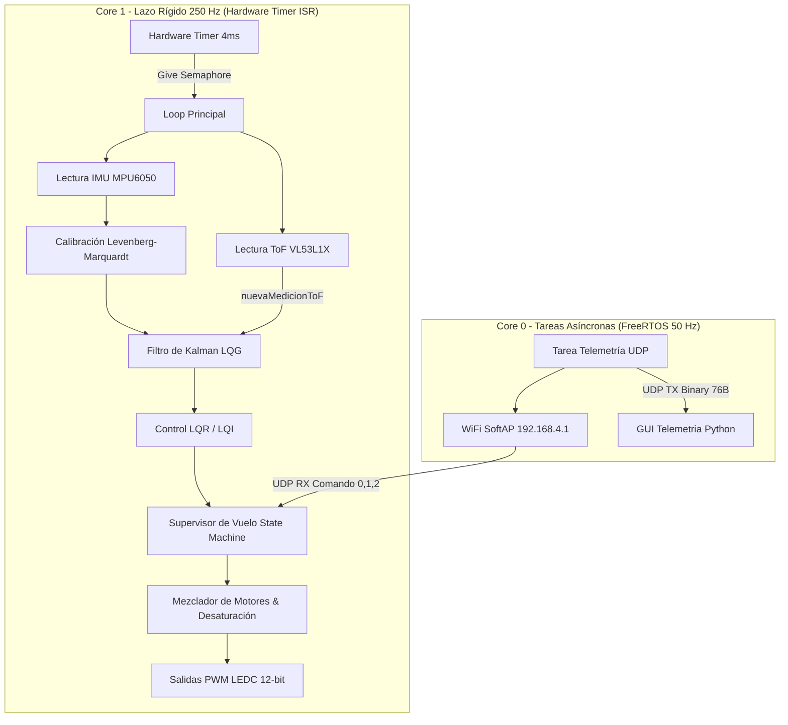
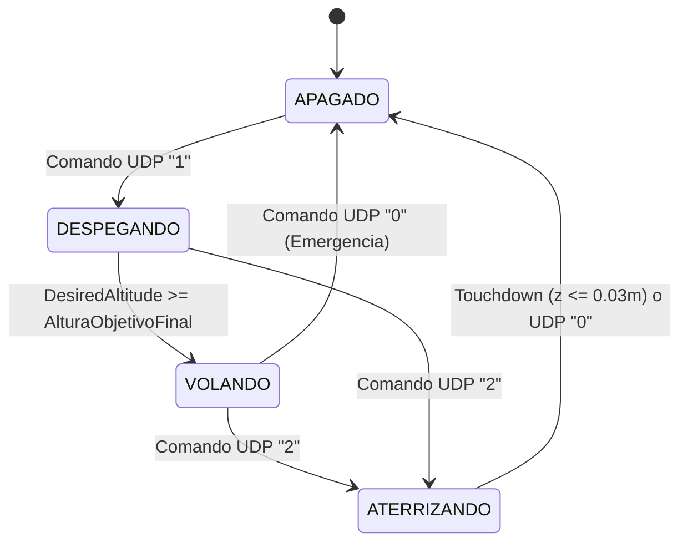

# 🚁 Documentación Técnica del Firmware: Dron LiteWing (LQG / FreeRTOS)

**Autor:** Agustín Schwerdt  
**Proyecto:** Proyecto Integrador Profesional (PIP) - Ingeniería Electrónica  
**Arquitectura:** Linear Quadratic Gaussian (LQR + Kalman LQE) en Tiempo Discreto  
**Frecuencia del Lazo Principal:** 250 Hz ($T_s = 4\text{ ms}$)  
**Procesador Target:** ESP32-S3 (Dual-Core Xtensa LX7 @ 240 MHz)  

---

## 📐 1. Visión General de la Arquitectura

El firmware del dron **LiteWing** implementa un esquema de **Control Óptimo Cuadrático Lineal Gaussiano (LQG)** desacoplado en cuatro canales independientes (**Roll**, **Pitch**, **Yaw** y **Altitud**). 

La arquitectura se fundamenta en el **Principio de Separación** (Åström & Wittenmark), donde el problema de control en tiempo real se divide en dos bloques principales:
1. **Filtro de Kalman Dinámico (LQE - Linear Quadratic Estimator):** Fusión sensorial estocástica para estimar el vector de estados $\hat{x}(k)$ minimizando la covarianza del error ante ruido de proceso y medición.
2. **Regulador Cuadrático Lineal (LQR/LQI):** Generación del esfuerzo óptimo de control $u(k) = -L \hat{x}(k)$ utilizando matrices de ganancia en estado estacionario precalculadas mediante la Ecuación Algebraica de Riccati Discreta (DARE).



---

## ⚡ 2. Arquitectura de Procesamiento Dual-Core y RTOS

Para garantizar un determinismo estricto sin el *jitter* de retardo habitual de los sistemas operativos, el firmware distribuye sus cargas de trabajo asimétricamente entre los dos núcleos del ESP32-S3:

| Núcleo | Tarea / Proceso | Frecuencia | Mecanismo de Sincronización | Responsabilidad |
| :--- | :--- | :--- | :--- | :--- |
| **Core 1** | Lazo de Control de Vuelo | **250 Hz (4 ms)** | Hardware Timer ISR + Semáforo Binario | Adquisición I2C, Filtro de Kalman, Leyes LQR, Supervisor de Vuelo y Escritura PWM a motores. |
| **Core 0** | Telemetría y Comms UDP | **50 Hz (20 ms)** | `xTaskCreatePinnedToCore` | Gestión de red WiFi SoftAP, recepción de comandos UDP de piloto y streaming binario de 76 bytes. |

### Mecanismo de Temporización de 250 Hz (Core 1)
```cpp
// Se configura el temporizador a 1 MHz (1 tick = 1 microsegundo)
controlTimer = timerBegin(1000000);
timerAttachInterrupt(controlTimer, &onTimer);
timerAlarm(controlTimer, 4000, true, 0); // Alarma cada 4000 us (250 Hz)

// La ISR entrega el semáforo binario sin bloquear la CPU:
void IRAM_ATTR onTimer() {
  BaseType_t xHigherPriorityTaskWoken = pdFALSE;
  xSemaphoreGiveFromISR(timerSemaphore, &xHigherPriorityTaskWoken);
  if (xHigherPriorityTaskWoken) portYIELD_FROM_ISR();
}
```

---

## 🛰️ 3. Adquisición Sensorial y Calibración

### 3.1. IMU MPU6050 (Acelerómetro + Giroscopio)
* **Bus I2C:** Operando a 400 kHz (*Fast Mode*) en pines `SDA=11`, `SCL=10`.
* **Filtro Pasa-Bajos Digital (DLPF):** Configurado a ~98 Hz (Registro `CONFIG = 0x02`), situando la frecuencia de corte por debajo del límite de Nyquist (125 Hz).
* **Escalas de Medición:**
  * Giroscopio: $\pm 500^\circ/\text{s}$ ($\text{Sensibilidad} = 65.5 \text{ LSB}/(^\circ/\text{s})$).
  * Acelerómetro: $\pm 8g$ ($\text{Sensibilidad} = 4096 \text{ LSB}/g$).

### 3.2. Modelo de Calibración No Lineal (Levenberg-Marquardt)
Las aceleraciones crudas $a_{raw}$ son corregidas en tiempo real utilizando la matriz de calibración de 9 parámetros ajustada mediante el algoritmo de Levenberg-Marquardt en Python:

$$\begin{bmatrix} a_x \\ a_y \\ a_z \end{bmatrix}_{Body} = 
\begin{bmatrix} 1 & 0 & 0 \\ \alpha_{yx} & 1 & 0 \\ \alpha_{zx} & \alpha_{zy} & 1 \end{bmatrix}
\begin{bmatrix} S_x & 0 & 0 \\ 0 & S_y & 0 \\ 0 & 0 & S_z \end{bmatrix}
\left( \begin{bmatrix} a_{x,crudo} \\ a_{y,crudo} \\ a_{z,crudo} \end{bmatrix} - \begin{bmatrix} B_x \\ B_y \\ B_z \end{bmatrix} \right)$$

Las constantes calibradas definidas en `Config.h` son:
```cpp
constexpr float ALFA_YX = 0.000278f;
constexpr float ALFA_ZX = 0.001603f;
constexpr float ALFA_ZY = 0.000864f;
constexpr float S_X     = 1.005936f;
constexpr float S_Y     = 0.997343f;
constexpr float S_Z     = 0.991658f;
constexpr float B_X     = 0.313151f;
constexpr float B_Y     = 0.016393f;
constexpr float B_Z     = 0.223452f;
```

### 3.3. Sensor Láser ToF (VL53L1X) y Gestión Multitasa (*Multi-rate*)
* Operación en modo `Short` (medición continua hasta 1.3 m) con un *Timing Budget* de 33 ms (~30 Hz).
* **Gestión Multitasa en Kalman:** Como la IMU se lee a 250 Hz y el ToF actualiza a ~30 Hz, `ToF.cpp` retorna una bandera `nuevaMedicionToF`. El Filtro de Kalman de altura ejecuta la **predicción cinemática en cada ciclo (250 Hz)**, pero **solamente ejecuta la corrección de innovación cuando `nuevaMedicionToF == true`**, previniendo la degradación de la estimación de velocidad vertical $V_z$.

---

## 🧮 4. Filtro de Kalman Dinámico (LQE)

### 4.1. Filtros de Actitud (Roll y Pitch - 2x2)
Modelan la dinámica cinemática discreta con matrices $\Phi$ y $\Gamma$:

$$\begin{bmatrix} x_1(k+1) \\ x_2(k+1) \end{bmatrix} = \begin{bmatrix} 1 & h \\ 0 & 1 \end{bmatrix} \begin{bmatrix} x_1(k) \\ x_2(k) \end{bmatrix} + \begin{bmatrix} \gamma_1 \\ \gamma_2 \end{bmatrix} u(k)$$

donde $x_1$ es el ángulo ($^\circ$) y $x_2$ es la velocidad angular ($^\circ/\text{s}$).

### 4.2. Filtro de Altura con Compensación de Inclinación (*Tilt Compensation*)
Para independizar la aceleración vertical de las maniobras de Roll y Pitch, se proyecta el vector 3D mediante la Matriz de Cosenos Directores (DCM) al marco terrestre (*Earth Frame Z-Down*):

$$a_{z,suelo} = -Acc_X \sin(\theta) + Acc_Y \sin(\phi)\cos(\theta) + Acc_Z \cos(\phi)\cos(\theta)$$

$$a_{net} = a_{z,suelo} - 9.80665 \text{ m/s}^2$$

La predicción cinemática de la altura $z$ y velocidad $V_z$ se calcula como:

$$\hat{z}(k+1\vert k) = \hat{z}(k\vert k) + h \hat{V}_z(k\vert k) + \frac{1}{2} h^2 a_{net}$$

$$\hat{V}_z(k+1\vert k) = \hat{V}_z(k\vert k) + h a_{net}$$

---

## 🎮 5. Control Óptimo (LQR / LQI)

Las ganancias estáticas de realimentación $L$ fueron precalculadas *offline* en Python resolviendo la Ecuación Algebraica de Riccati en Tiempo Discreto (DARE).

### 5.1. Canales Roll y Pitch (LQI - LQR con Acción Integral)
Para asegurar error nulo en estado estacionario ante perturbaciones o asimetrías de peso, se incluye un estado integral $x_i = \int (\text{ángulo} - \text{referencia}) dt$ con clamping Anti-Windup:

```cpp
// Canal Roll LQI
float err_roll_0 = x_hat_roll[0] - DesiredAngleRoll;
float err_roll_1 = x_hat_roll[1] - 0.0f;
integral_roll += err_roll_0 * h;
integral_roll = constrain(integral_roll, -15.0f, 15.0f); // Anti-windup

u_roll = -(L_roll[0] * err_roll_0 + L_roll[1] * err_roll_1 + L_roll[2] * integral_roll);
```

### 5.2. Canal Yaw (LQR 1D)
$$u_{yaw} = - L_{yaw} (\hat{\dot{\psi}} - \text{DesiredRateYaw})$$

### 5.3. Canal Altitud (LQR Posición Z)
$$u_{alt} = - \left( L_{alt,0} (\hat{z} - z_{ref}) + L_{alt,1} \hat{V}_z \right)$$
*(Con limitador de seguridad de salida $u_{alt} \in [-500, +500]$ PWM).*

### Ganancias LQR Precalculadas (`Config.h`):
* `L_roll` / `L_pitch`: `[10.8384, 10.9379, 4.4541]`
* `L_yaw`: `[22.36]`
* `L_alt`: `[1715.94, 853.27]`

---

## 🔄 6. Supervisor de Vuelo (Máquina de Estados)

El ciclo de vuelo está gestionado por la máquina de estados finitos en `Supervisor.cpp`:



1. **`APAGADO`**: Motores detenidos (`PWM = 0`), integrales reseteadas a cero.
2. **`DESPEGANDO`**:
   * **Fase 1 (Rampa suave):** `baseThrottleDinamico` incrementa en `+2.0` PWM cada ciclo (4 ms) hasta alcanzar `THROTTLE_HOVER`. `DesiredAltitude` acompaña a la altura real para evitar saltos en el LQR.
   * **Fase 2 (Ascenso controlado):** Una vez alcanzado `THROTTLE_HOVER`, se aplica la técnica industrial de *Tracking Error Limit*: la referencia `DesiredAltitude` incrementa a razón de `TasaAscenso` (0.001 m/ciclo) solo si el error de seguimiento $(z_{ref} - z) < 5 \text{ cm}$.
3. **`VOLANDO`**: Mantiene la altitud objetivo constante ($z_{ref} = 0.5\text{ m}$) combinando `THROTTLE_HOVER` + $u_{alt}$ + correcciones de actitud.
4. **`ATERRIZANDO`**: Disminuye suavemente la referencia de altitud. Al detectar la proximidad al piso ($z \le 0.03\text{ m}$), pasa automáticamente a `APAGADO`.

---

## ⚙️ 7. Mezclador de Motores y Actuación

### 7.1. Configuración Física en 'X'
```
   (M4 - FL - CCW)      (M1 - FR - CW)
               \      /
                \    /
                 [Dron]
                /    \
               /      \
   (M3 - RL - CW)       (M2 - RR - CCW)
```

### 7.2. Ecuaciones del Mezclador Aeronáutico
```cpp
float m1_raw = throttleBase - controlRoll + controlPitch - controlYaw; // M1 FR
float m2_raw = throttleBase - controlRoll - controlPitch + controlYaw; // M2 RR
float m3_raw = throttleBase + controlRoll - controlPitch - controlYaw; // M3 RL
float m4_raw = throttleBase + controlRoll + controlPitch + controlYaw; // M4 FL
```

### 7.3. Desaturación Prioritaria de Torque
Si el cálculo del LQR requiere una salida superior a la resolución máxima del PWM (4095):
$$\text{exceso} = \max(m_1, m_2, m_3, m_4) - 4095$$
$$m_{i,final} = m_{i,raw} - \text{exceso}$$
*Esta técnica le resta el exceso por igual a los 4 motores, garantizando la conservación de los pares de inclinación/rotaciones (actitud) priorizándolos sobre la altitud.*

### 7.4. Compensación por Caída de Tensión de Batería
Un filtro IIR sobre el pin analógico `PIN_BATERIA` calcula el factor de compensación:
$$\text{FactorCompensacion} = \frac{V_{nominal}}{V_{bateria\_real}}$$
multiplicando linealmente la señal PWM enviada a los MOSFETs.

---

## 📁 8. Estructura de Archivos del Proyecto

```
firmware_dron/
├── firmware_dron.ino   # Orquestador principal, ISR, Timer y setup de FreeRTOS
├── Config.h            # Parámetros físicos, matrices LQG, ganancias LQR y asignación de pines
├── IMU.h / IMU.cpp     # Lectura I2C del MPU6050 y calibración Levenberg-Marquardt
├── ToF.h / ToF.cpp     # Interfaz y medición del sensor láser VL53L1X
├── Kalman.h / Kalman.cpp # Algoritmo LQE recursivo multitasa (Roll, Pitch, Yaw, Altura DCM)
├── LQR.h / LQR.cpp     # Cálculo de ley de control discreta LQI/LQR y clamping
├── Motores.h / Motores.cpp # Mezclador de motores, desaturación prioritaria y control LEDC PWM
├── Supervisor.h / Supervisor.cpp # Máquina de estados de vuelo y rampas de despegue/aterrizaje
├── Telemetria.h / Telemetria.cpp # Red WiFi SoftAP, socket UDP y empaquetado binario de 76 bytes
└── README.md           # Documentación técnica general
```

---

## 📊 9. Estructura del Paquete Binario de Telemetría UDP (76 Bytes)

El paquete de telemetría emitido a 50 Hz por el Core 0 hacia la aplicación Python (`Telemetria.py`) posee el siguiente formato empaquetado en memoria (`__attribute__((packed))`):

| Offsets (Bytes) | Tipo | Variable | Descripción |
| :--- | :--- | :--- | :--- |
| `0 - 3` | `uint32_t` | `timestamp` | Estampa de tiempo del microcontrolador ($\mu s$). |
| `4 - 15` | `float[3]` | `accX, accY, accZ` | Aceleraciones lineales corregidas ($m/s^2$). |
| `16 - 31` | `float[4]` | `rollAcc, rollGyr, rollKalman, rollRateKalman` | Datos del canal Roll. |
| `32 - 47` | `float[4]` | `pitchAcc, pitchGyr, pitchKalman, pitchRateKalman` | Datos del canal Pitch. |
| `48 - 55` | `float[2]` | `yawRateGyr, yawRateKalman` | Datos del canal Yaw. |
| `56 - 67` | `float[3]` | `altToF, altKalman, vzKalman` | Altitud bruta ToF, Altitud y Velocidad Kalman. |
| `68 - 71` | `float` | `vBat` | Voltaje filtrado de la batería ($V$). |
| `72 - 75` | `float` | `temp` | Temperatura interna de la IMU ($^\circ C$). |

---

## 🛠️ 10. Manual de Ajuste y Puesta en Vuelo

1. **Ajuste del Peso / Thrust de Vuelo:**
   Abrir `Config.h` o `Supervisor.cpp` y configurar `THROTTLE_HOVER` con el valor PWM (0 a 4095) en el cual el dron alcanza el equilibrio de sustentación (típicamente entre 1600 y 2000).
2. **Conexión a la Telemetría:**
   Encender el dron, conectarse a la red WiFi Access Point `LiteWing_Agus` (Password: `12345678`), y ejecutar la consola de visualización gráfica en tiempo real:
   ```bash
   python Telemetria.py
   ```
3. **Comandos de Control Remoto (Vía UDP Port 4210):**
   * Enviar **`1`**: Dispara la rampa automática de despegue y estabilización a 50 cm.
   * Enviar **`2`**: Dispara la rampa de descenso suave y corte por *touchdown*.
   * Enviar **`0`**: **Corte Instantáneo de Emergencia** en hardware.